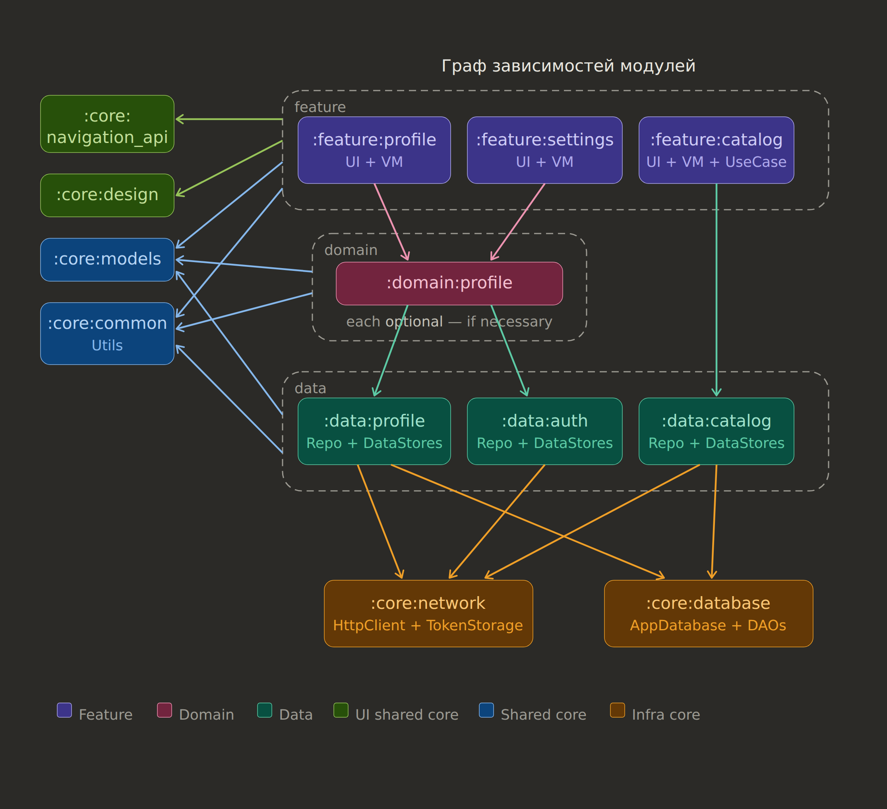

# Staya

Android-приложение на Kotlin + Jetpack Compose с модульной архитектурой.

## Архитектура приложения



### Слои и модули

Проект разделён на пять слоёв, каждый со своей зоной ответственности. Зависимости строго однонаправленные: **feature → domain (опционально) → data → core**. Циклические зависимости между модулями запрещены.

---

###  Feature-слой

Каждый экран приложения — отдельный Gradle-модуль. Внутри: Compose UI, ViewModel и, при необходимости, UseCase/Interactor.

```
:feature:profile/
    di/
        ProfileNavigationModule ← содержит @IntoSet провайдер EntryBuilder для подключения роутов навигации из ProfileNavigation в модуль `:app`.
    navigation/
        ProfileNavigation.kt    ← содержит функцию для регистрирации navigation entries для модуля
    ui/
        ProfileScreen.kt
        ProfileViewModel.kt
    domain/                     ← только если UseCase не переиспользуется
        GetProfileUseCase.kt
```

Feature-модули зависят от `:core:navigation_api` и могут зависеть от `:core:design`, `:core:models`, `:core:common`, а также от нужных `:data:*` или `:domain:*` модулей.

Feature-модули **не знают друг о друге** — переходы между экранами осуществляются через route-константы из `:core:navigation_api`.

UseCase как правило необходим, но если он дублирует вызов функций единственного репозитория, то от него можно откзаться и использовать репозиторий напрямую.

---

###  Domain-слой — опциональный

Domain-модуль создаётся **только** при выполнении одного из условий:

1. **UseCase переиспользуется** в нескольких feature-модулях. Если UseCase нужен только одному экрану — он живёт внутри feature-модуля в пакете `domain/`.

2. **Несколько UseCase нужно объединить в Interactor.** Interactor — это класс, который комбинирует вызовы нескольких UseCase или репозиториев в единый сценарий. Если Interactor используется одной фичей — он остаётся в feature-модуле. Если несколькими — выносится в domain-модуль.

```
:domain:profile/
    GetProfileUseCase.kt           ← переиспользуется в :feature:profile и :feature:settings
    UpdateProfileUseCase.kt        ← переиспользуется в :feature:profile и :feature:settings
    ProfileInteractor.kt           ← комбинирует UseCase в единый сценарий
```

Domain-модули зависят от: `:data:*` (один или несколько), а также могут зависеть `:core:models`, `:core:common`.

Если UseCase просто прокидывает вызов в репозиторий без дополнительной логики — его не нужно создавать. ViewModel может обращаться к репозиторию напрямую через data-модуль. Но это на усмотрение.

---

###  Data-слой

Каждая доменная сущность, которая требует работы с сетью или БД, получает свой data-модуль. Модуль содержит Repository и **максимум два** DataStore: Remote и Local.

```
:data:profile/
    ProfileRepository.kt
    ProfileRemoteDataStore.kt
    ProfileLocalDataStore.kt
    ProfileMapper.kt               ← DTO ↔ Entity ↔ Domain model
```

Структура плоская — при 3–4 файлах подпапки `remote/` и `local/` избыточны.

Data-модули зависят от: `:core:network`, `:core:database`, `:core:models`, `:core:common`.

Не каждый data-модуль обязан иметь оба DataStore. Например, `:data:auth` работает только с Remote и `TokenStorage`, без локального кеша.

Интерфейсы для Repository и DataStore не используются — считаем, это лишний слой абстракции. Создавать интерфейсы только при реальной необходимости.

---

### Core-слой

Core-модули делятся на три группы по области применения.

####  UI Shared Core — только для feature-слоя

**`:core:navigation_api`** — route-константы, аргументы навигации, навигационные контракты. Позволяет feature-модулям ссылаться на экраны друг друга без прямых зависимостей. Реализация навигации живёт в `:app` модуле.

**`:core:design`** — дизайн-система: тема, цвета, типографика, переиспользуемые Compose-компоненты. Все UI-элементы, общие для нескольких экранов.

####  Shared Core — для feature, domain и data слоёв

**`:core:models`** — чистые доменные модели: `data class`, `sealed class`, `enum`. Никаких аннотаций Room, Ktor, сериализации. Ноль зависимостей на другие модули.

**`:core:common`** — общие утилиты: расширения, хелперы, обёртки. Должен оставаться чистым Kotlin-модулем без Android-зависимостей. Если утилита нужна только одному слою — она живёт в этом слое, а не в common.

####  Infra Core — только для data-слоя

**`:core:network`** — экземпляр HTTP-клиента (Ktor), `TokenStorage` для хранения авторизационных токенов, `AuthInterceptor` для автоматической подстановки `Bearer`-заголовка, `ApiResponse` как обёртка результата, `safeApiCall` для единообразной обработки ошибок.

**`:core:database`** — экземпляр Room БД, все DAO и Entity. DAO и Entity вынуждены жить здесь из-за технического ограничения Room: БД должна знать обо всех таблицах при создании. Data-модули получают нужный DAO через DI.

---

### Граф зависимостей

```
:feature:*       → :domain:*  (опционально)
:feature:*       → :data:*    (напрямую, если без domain)
:feature:*       → :core:navigation_api, :core:design, :core:models, :core:common

:domain:*        → :data:*
:domain:*        → :core:models, :core:common

:data:*          → :core:network, :core:database
:data:*          → :core:models, :core:common

:core:models     → (ничего)
:core:common     → (ничего)
```

---

### Когда создавать domain-модуль: чек-лист

| Ситуация | Где живёт логика |
|---|---|
| UseCase нужен одному экрану, логика простая | Напрямую в ViewModel без UseCase |
| UseCase нужен одному экрану, логика сложная | `domain/` пакет внутри feature-модуля |
| UseCase нужен нескольким экранам | Отдельный `:domain:*` модуль |
| Несколько UseCase комбинируются в сценарий для одного экрана | Interactor внутри feature-модуля |
| Несколько UseCase комбинируются в сценарий для нескольких экранов | Interactor внутри `:domain:*` модуля |
